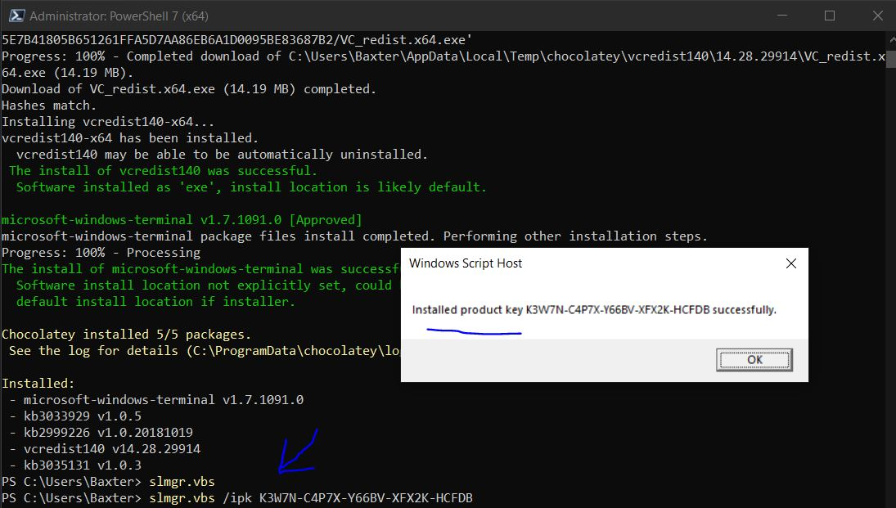
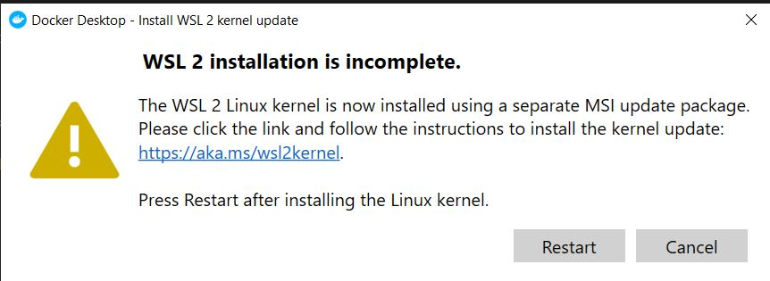
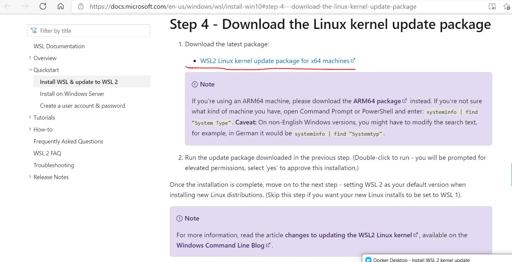
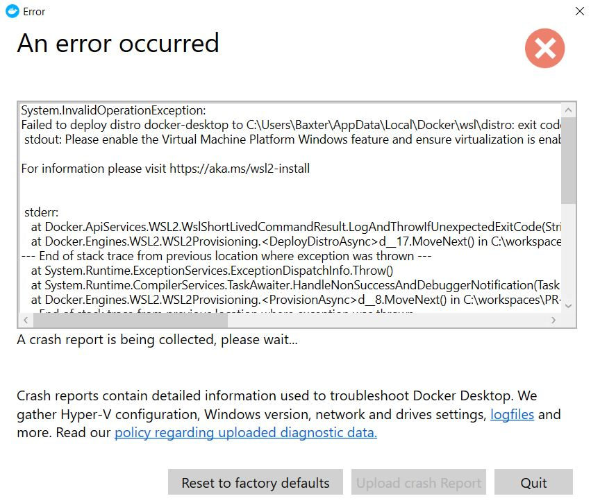
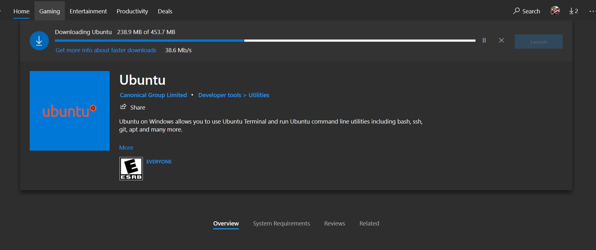
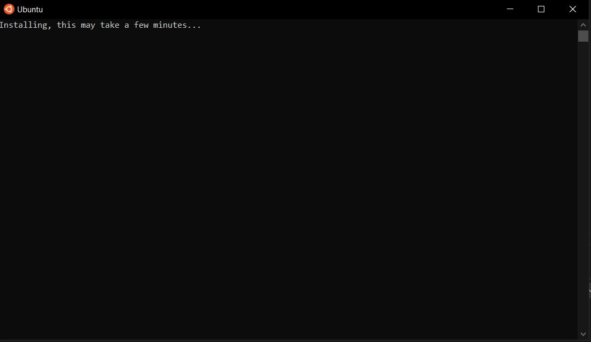

# VM Setup Log

## Bringing a fresh VM up as a Containerized Sitecore XP development machine
## Repo = https://git.rockfin.com/marketing-web/sitecore-global-components-server.git

**By:** Baxter Lane

**On:** May 21, 2021

---

1. Run "Check for Updates" until there are none left to install

2. Setup windows explorer to show all files and show file extensions (__Optional__)

**From an elevated powershell window run the following commands**

```Powershell

$key = 'HKCU:\Software\Microsoft\Windows\CurrentVersion\Explorer\Advanced'
Set-ItemProperty $key Hidden 1
Set-ItemProperty $key HideFileExt 0
Set-ItemProperty $key ShowSuperHidden 1
Stop-Process -processname explorer

```

3. Rename the VM to DockerXP (__Optional__)

**From an elevated powershell window run the following commands**

```Powershell
Rename-Computer -NewName DockerXP
Restart-Computer
```

4. Enable Remote Desktop Connections (__Optional__)

**From an elevated powershell window run the following commands**

```Powershell

Set-ItemProperty -Path ‘HKLM:\System\CurrentControlSet\Control\Terminal Server’-name “fDenyTSConnections” -Value 0
Enable-NetFirewallRule -DisplayGroup “Remote Desktop”

```

5. Disconnect your host from Pulse Secure by running "Pulse Secure Start Stop" from the start menu

6. Install Chocolatey

**From an elevated powershell window run the following commands**

```Powershell

Set-ExecutionPolicy Bypass -Scope Process -Force; 
[System.Net.ServicePointManager]::SecurityProtocol = [System.Net.ServicePointManager]::SecurityProtocol -bor 3072; 
Invoke-Expression -Command ((New-Object System.Net.WebClient).DownloadString('https://chocolatey.org/install.ps1'))

```

7. Install Powershell Core

**From an elevated powershell window run the following commands**

```Powershell

choco install powershell-core -y

```

8. Install VS Code

**From an elevated powershell window run the following commands**

```Powershell

choco install vscode -y

```

9. Install Git

**From an elevated powershell window run the following commands**

```Powershell

choco install git -y

```

Close all Powershell consoles

10. Configure Git

**From an elevated powershell window run the following commands, replace the UID and Email with your own**

```Powershell

git config --global user.name "Baxter Lane"
git config --global user.email baxterlane@quickenloans.com
git config --global core.editor "code --wait"
git config --list

```

11. Set the timezone to Eastern (__Optional__)

**From an elevated powershell window run the following commands**

```Powershell
Set-TimeZone -Id "Eastern Standard Time"
```

12. Install 7-zip (__Optional__)

**From an elevated powershell window run the following commands**

```Powershell
choco install 7zip -y
```

13. Install Microsoft Windows Terminal (__Optional__)

**From an elevated powershell window run the following commands**

```Powershell
choco install microsoft-windows-terminal -y
```

14. Activate Windows 10

**From an elevated powershell window run the following commands**

**Note:** You will need to use your own key from your own ROCK my.visualstudio.com account, and it is easiest
to use a "Windows 10 Pro - MultipleActivation" key. Please do not use this key, I include it only for completeness of the log. 
You are going to want to use the **Pulse Secure Start Stop** on the host of this VM before connecting to my.visualstudio.com,
else your login will fail. Make sure to stop the Pulse Secure VPN once you have the nessesary key.  

```Powershell
slmgr.vbs /ipk K3W7N-C4P7X-Y66BV-XFX2K-HCFDB
```



15. Install Node JS

**From an elevated powershell window run the following commands**

```Powershell
choco install nodejs -y
```

Close all of the powershell instances

Open Powershell as an Admin

Double check npm and node are installed

```Powershell
PS C:\Users\Baxter> node -v
v16.2.0
PS C:\Users\Baxter> npm -v
npm notice
npm notice New minor version of npm available! 7.13.0 -> 7.14.0
npm notice Changelog: https://github.com/npm/cli/releases/tag/v7.14.0
npm notice Run npm install -g npm@7.14.0 to update!
npm notice
7.13.0
```

16. Install Visual Studio 2019 Enterprise 

**From an elevated powershell window run the following commands**

```Powershell

choco install visualstudio2019enterprise -y

```

17. Install VS 2019 Desktop Dev Workload and all Options

**From an elevated powershell window run the following commands**

```Powershell
choco install visualstudio2019-workload-manageddesktop --includeOptional -y
```

18. Install VS 2019 .Net Core Dev Workload and all Options

**From an elevated powershell window run the following commands**

```Powershell
choco install visualstudio2019-workload-netcoretools --includeOptional -y
```

Close all of your Powershell consoles

Reopen in Admin mode 

19. Install VS 2019 ASP .Net Workload and all Options

**From an elevated powershell window run the following commands**

```Powershell
choco install visualstudio2019-workload-netweb --includeOptional -y
```

Close all of your Powershell consoles

Reopen in Admin mode 

20. Install VS 2019 Node JS Workload and all Options

**From an elevated powershell window run the following commands**

```Powershell
choco install visualstudio2019-workload-node --includeOptional -y
```

21. Install VS 2019 Extension Dev Workload and all Options (__Optional__)

**From an elevated powershell window run the following commands**

```Powershell
choco install visualstudio2019-workload-visualstudioextension --includeOptional -y
```

22. Manually Configure Visual Studio 2019

    * From your VM Host
        * Connect the VPN with "Pulse Secure Start Stop"
        * Navigate to https://my.visualstudio.com
        * Login with your corporate account when/if prompted 
        * Select Downloads
        * Search Downloads for "Visual Studio 2019 Enterprise"
        * Select "Get Key" Under a Visual Studio 2019 Enterprise download
        * Copy the key for "Visual Studio Enterprise 2019 - Retail", save this key in a temp file
            * If no key is show Select "Claim Key" and then copy it 
        
        

        * Disconnect from the VPN with "Pulse Secure Start Stop"

    * Open VS 2019
    * Login with your email/pwd when prompted, you will not be able to use your corp account
        * __Something to do with how the VPN/Group Policy or something keeps the login from working__
    * Choose **continue without code** when prompted to open or create a project
    * Choose Help -> Register Product from the main menu 

    

    * Select "Unlock with a product key"
    * Enter the product key obtained above and click apply 
    
    

23. Install .Net SDK 4.8 (full)

**From an elevated powershell window run the following commands**

```Powershell
choco install netfx-4.8-devpack -y
```

24. Install .Net SDK 2.1

**From an elevated powershell window run the following commands**

```Powershell
choco install dotnetcore-2.1-sdk -y
```

25. Enabled Hyper-V on Windows 10

**From an elevated powershell window run the following commands**

```Powershell
Enable-WindowsOptionalFeature -Online -FeatureName:Microsoft-Hyper-V -All -NoRestart
Restart-Computer
```

26. Install Docker Desktop

**From an elevated powershell window run the following commands**

```Powershell
choco install docker-desktop -y
Restart-Computer
```

27. Finish Setting up Docker Desktop

After logging in you should presented with this prompt



Click on the link in the page as indicated



Run the downloaded File and go through the install wizard

```Powershell
Start-Process "$Env:USERPROFILE\Downloads\wsl_update_x64.msi"
```

Click "Restart" on the WSL 2 Installation is incomplete prompt

Throws an error as below



Now install a Linux Distro from the Microsoft store

    * Open "Microsoft Store"
    * Pick a Distro, I picked "Ubunto" and install it

**Ubuntu Installing from the Microsoft Store**



    * Click the windows key and search for and select Ubunto

**Ubuntu Installing after launching**



    * Enter the username for your WSL2 Ubuntu instance
    * Enter a password 
    * Reboot your computer
    * The error is still there so...
    * Start Docker Desktop Twice and choose to switch to windows containers from the docker icon near the clock 

Fails again but prompts to run the below script 

Enable-WindowsOptionalFeature -Online -FeatureName $("Microsoft-Hyper-V", "Containers") -All

After rebooting Docker still failed with the WSL2 error

After restarting it again after it failed I was able to change to the Windows Containers reboot and it is fine 


