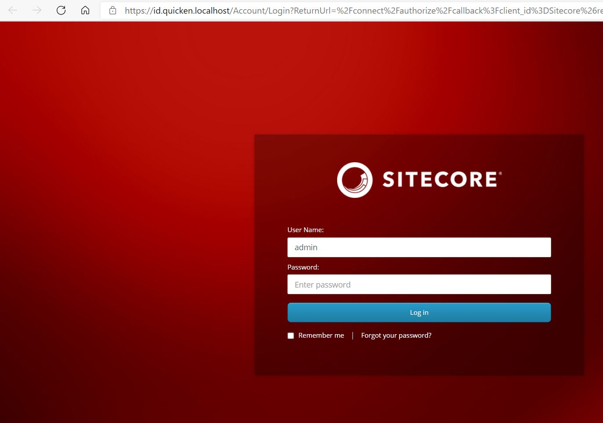

# Installing And Running Sitecore XP With Docker

**By:** Baxter Lane

**On:** May 25, 2021

# Abstract

This document will detail the steps to install Containerized Sitecore XP with Docker

As well as how to login to Sitecore for the first time 

It assumes the Prerequisite steps have all been successfully completed

[VM Prerequisite Setup Instructions](VMPrerequisiteSetupLog.md)

# Steps

<h2>1. Execute a Docker Build</h2>

**From an elevated powershell window run the following commands**

```Powershell
Set-Location -Path "$($env:devReposFolder)sitecore-global-components-server$([System.IO.Path]::DirectorySeparatorChar)"

docker-compose build
```

<h2>2. Execute a Docker Up</h2>

**From an elevated powershell window run the following commands**

```Powershell
Set-Location -Path "$($env:devReposFolder)sitecore-global-components-server$([System.IO.Path]::DirectorySeparatorChar)"

docker-compose up -d
```

<h2>3. Double Check that the Containers are running</h2>

**From an elevated powershell window run the following commands**

```Powershell
Set-Location -Path "$($env:devReposFolder)sitecore-global-components-server$([System.IO.Path]::DirectorySeparatorChar)"

docker-compose ps

C:\Projects\sitecore-global-components-server [feature/update-readme-from-rocket-server-repo-and-setup-notes ≡ +0 ~1 -0 !]> docker-compose ps
                   Name                                 Command                  State                              Ports
-------------------------------------------------------------------------------------------------------------------------------------------------
quicken-dev-build_cm_1                       powershell -Command & C:\t ...   Up (healthy)   80/tcp
quicken-dev-build_cortexprocessingworker_1   C:\LogMonitor\LogMonitor.e ...   Up (healthy)
quicken-dev-build_hostswriter_1              dotnet windows-hosts-write ...   Up
quicken-dev-build_id_1                       C:\LogMonitor\LogMonitor.e ...   Up (healthy)   80/tcp
quicken-dev-build_mssql_1                    powershell -Command $Error ...   Up (healthy)   0.0.0.0:14330->1433/tcp
quicken-dev-build_solr-init_1                powershell -Command $Error ...   Exit 0
quicken-dev-build_solr_1                     powershell -Command $Error ...   Up (healthy)   0.0.0.0:8984->8983/tcp
quicken-dev-build_traefik_1                  /traefik --ping --api.inse ...   Up (healthy)   0.0.0.0:443->443/tcp, 80/tcp, 0.0.0.0:8079->8080/tcp
quicken-dev-build_xconnect_1                 powershell -Command & C:\t ...   Up (healthy)   0.0.0.0:8081->80/tcp
quicken-dev-build_xdbautomationworker_1      C:\LogMonitor\LogMonitor.e ...   Up (healthy)
quicken-dev-build_xdbsearchworker_1          C:\LogMonitor\LogMonitor.e ...   Up (healthy)
```

<h2>4. Connect to the Sitecore CM Default Site</h2>

**From an elevated powershell window run the following commands**

```Powershell
Start-Process "https://cm.quicken.localhost"
```

<h3>Success</h3>


<h2>5. Confirm you can login to Sitecore</h2>

**From an elevated powershell window run the following commands**

```Powershell
Start-Process "https://cm.quicken.localhost/sitecore/shell"
```

<h3>Login</h3>



* <strong>UID:</strong> admin
* <strong>PWD:</strong> Password12345

<h3>Success</h3>

