# VM Prerequisites Setup Log

**By:** Baxter Lane

**On:** May 21, 2021

# Abstract

This document details the steps required to setup a fresh Windows 10 VM for use
as a Containziered Sitecore XP Development Machine 

These steps should prepare you to be able to run the various Docker commands required
to install and bring up the Sitecore instances

As well as having a fully functional development machine contained within the VM

# Steps

<h2>1. Run "Check for Updates" until there are none left to install</h2>

<h2>2. Setup windows explorer to show all files and show file extensions (<em>Optional</em>)</h2>

**From an elevated powershell window run the following commands**

```Powershell

$key = 'HKCU:\Software\Microsoft\Windows\CurrentVersion\Explorer\Advanced'
Set-ItemProperty $key Hidden 1
Set-ItemProperty $key HideFileExt 0
Set-ItemProperty $key ShowSuperHidden 1
Stop-Process -processname explorer

```

<h2>3. Rename the VM to DockerXP (<em>Optional</em>)</h2>

**From an elevated powershell window run the following commands**

```Powershell
Rename-Computer -NewName DockerXP
Restart-Computer
```

<h2>4. Enable Remote Desktop Connections (<em>Optional</em>)</h2>

**From an elevated powershell window run the following commands**

```Powershell

Set-ItemProperty -Path ‘HKLM:\System\CurrentControlSet\Control\Terminal Server’-name “fDenyTSConnections” -Value 0
Enable-NetFirewallRule -DisplayGroup “Remote Desktop”

```

<h2>5. Disconnect your host from Pulse Secure by running "Pulse Secure Start Stop" from the start menu</h2>

<h2>6. Install Chocolatey</h2>

**From an elevated powershell window run the following commands**

```Powershell

Set-ExecutionPolicy Bypass -Scope Process -Force; 
[System.Net.ServicePointManager]::SecurityProtocol = [System.Net.ServicePointManager]::SecurityProtocol -bor 3072; 
Invoke-Expression -Command ((New-Object System.Net.WebClient).DownloadString('https://chocolatey.org/install.ps1'))

```

<h2>7. Install Powershell Core</h2>

**From an elevated powershell window run the following commands**

```Powershell

choco install powershell-core -y

```

<h2>8. Install VS Code</h2>

**From an elevated powershell window run the following commands**

```Powershell

choco install vscode -y

```

<h2>9. Install Git</h2>

**From an elevated powershell window run the following commands**

```Powershell

choco install git -y

```

Close all Powershell consoles

<h2>10. Configure Git</h2>

**From an elevated powershell window run the following commands, replace the UID and Email with your own**

```Powershell

git config --global user.name "Baxter Lane"
git config --global user.email baxterlane@quickenloans.com
git config --global core.editor "code --wait"
git config --list

```

<h2>11. Set the timezone to Eastern (<em>Optional</em>)</h2>

**From an elevated powershell window run the following commands**

```Powershell
Set-TimeZone -Id "Eastern Standard Time"
```

<h2>12. Install 7-zip (<em>Optional</em>)</h2>

**From an elevated powershell window run the following commands**

```Powershell
choco install 7zip -y
```

<h2>13. Install Microsoft Windows Terminal (<em>Optional</em>)</h2>

**From an elevated powershell window run the following commands**

```Powershell
choco install microsoft-windows-terminal -y
```

<h2>14. Activate Windows 10</h2>

**From an elevated powershell window run the following commands**

**Note:** You will need to use your own key from your own ROCK my.visualstudio.com account, and it is easiest
to use a "Windows 10 Pro - MultipleActivation" key. Please do not use this key, I include it only for completeness of the log. 
You are going to want to use the **Pulse Secure Start Stop** on the host of this VM before connecting to my.visualstudio.com,
else your login will fail. Make sure to stop the Pulse Secure VPN once you have the nessesary key.  

```Powershell
slmgr.vbs /ipk K3W7N-C4P7X-Y66BV-XFX2K-HCFDB
```

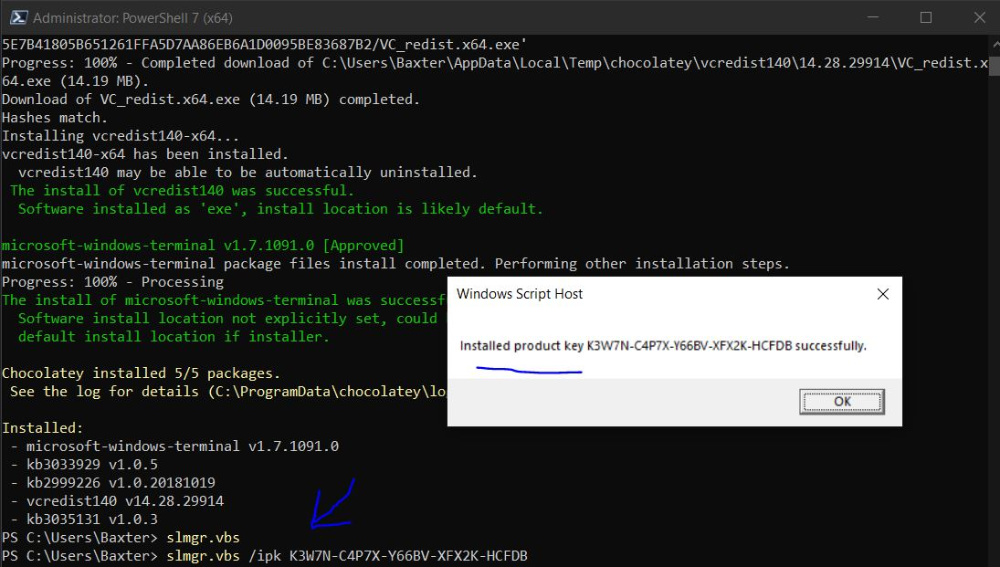

<h2>15. Install Node JS</h2>

**From an elevated powershell window run the following commands**

```Powershell
choco install nodejs -y
```

Close all of the powershell instances

Open Powershell as an Admin

Double check npm and node are installed

```Powershell
PS C:\Users\Baxter> node -v
v16.2.0
PS C:\Users\Baxter> npm -v
npm notice
npm notice New minor version of npm available! 7.13.0 -> 7.14.0
npm notice Changelog: https://github.com/npm/cli/releases/tag/v7.14.0
npm notice Run npm install -g npm@7.14.0 to update!
npm notice
7.13.0
```

<h2>16. Install Visual Studio 2019 Enterprise</h2>

**From an elevated powershell window run the following commands**

```Powershell

choco install visualstudio2019enterprise -y

```

<h2>17. Install VS 2019 Desktop Dev Workload and all Options</h2>

**From an elevated powershell window run the following commands**

```Powershell
choco install visualstudio2019-workload-manageddesktop --includeOptional -y
```

<h2>18. Install VS 2019 .Net Core Dev Workload and all Options</h2>

**From an elevated powershell window run the following commands**

```Powershell
choco install visualstudio2019-workload-netcoretools --includeOptional -y
```

Close all of your Powershell consoles

Reopen in Admin mode 

<h2>19. Install VS 2019 ASP .Net Workload and all Options</h2>

**From an elevated powershell window run the following commands**

```Powershell
choco install visualstudio2019-workload-netweb --includeOptional -y
```

Close all of your Powershell consoles

Reopen in Admin mode 

<h2>20. Install VS 2019 Node JS Workload and all Options</h2>

**From an elevated powershell window run the following commands**

```Powershell
choco install visualstudio2019-workload-node --includeOptional -y
```

<h2>21. Install VS 2019 Extension Dev Workload and all Options (<em>Optional</em>)</h2>

**From an elevated powershell window run the following commands**

```Powershell
choco install visualstudio2019-workload-visualstudioextension --includeOptional -y
```

<h2>22. Manually Configure Visual Studio 2019</h2>

<h3>22.1. Get the product key from your MSDN account</h3>  
    
* Connect the VPN with "Pulse Secure Start Stop"
* Navigate to https://my.visualstudio.com
* Login with your corporate account when/if prompted 
* Select Downloads
* Search Downloads for "Visual Studio 2019 Enterprise"
* Select "Get Key" Under a Visual Studio 2019 Enterprise download
* Copy the key for "Visual Studio Enterprise 2019 - Retail", save this key in a temp file
    * If no key is show Select "Claim Key" and then copy it 
        
<br>
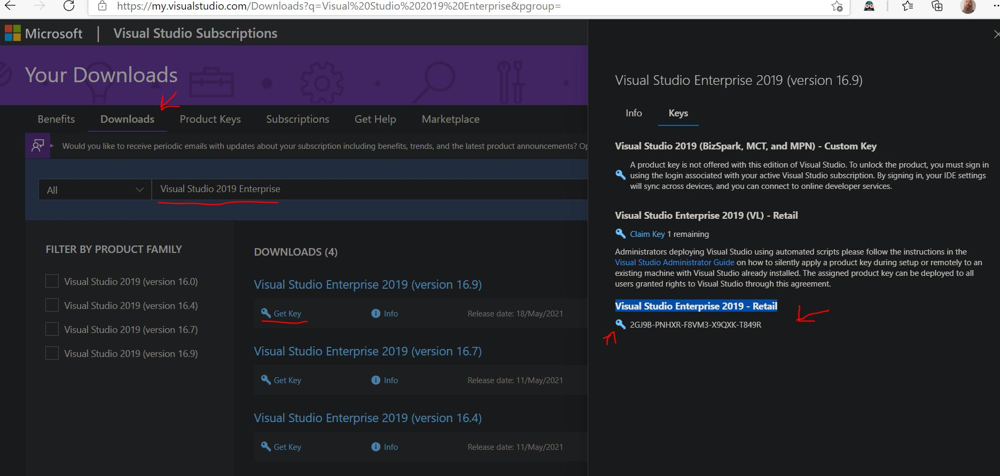

<h3>22.2. Enter your Key into Visual Studio 2019</h3>

* Open VS 2019
* Login with your corporate email address and password
* Choose your preferred them, Dark is the most common and recommended     
* Choose **continue without code** when prompted to open or create a project
* Choose Help -> Register Product from the main menu 

<br>
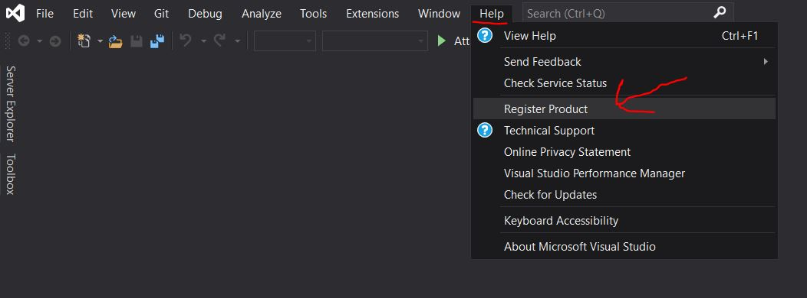

* Select "Unlock with a product key"
* Enter the product key obtained above and click apply 
    
<br>
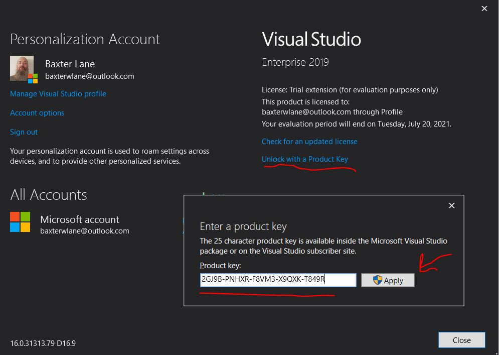

* Disconnect the VPN with "Pulse Secure Start Stop" 

<h2>23. Install .Net SDK 4.8 (full)</h2>

**From an elevated powershell window run the following commands**

```Powershell
choco install netfx-4.8-devpack -y
```

<h2>24. Install .Net SDK 2.1</h2>

**From an elevated powershell window run the following commands**

```Powershell
choco install dotnetcore-2.1-sdk -y
```

<h2>25. Enabled Hyper-V on Windows 10</h2>

**From an elevated powershell window run the following commands**

```Powershell
Enable-WindowsOptionalFeature -Online -FeatureName:Microsoft-Hyper-V -All -NoRestart
Restart-Computer
```

<h2>26. Manually Enable and Install WSL2</h2>

**These steps come from the following article**

[Windows Subsystem for Linux Installation Guide for Windows 10](https://docs.microsoft.com/en-us/windows/wsl/install-win10#manual-installation-steps)

Following the **Manual Installation Steps** since the version of windows isn't compatible with the Insider Program steps

<h3>26.1. Enable the Windows Subsystem for Linux</h3>

**From an elevated powershell window run the following commands**

```Powerhsell
dism.exe /online /enable-feature /featurename:Microsoft-Windows-Subsystem-Linux /all /norestart
```

<h3>26.2. Enable Virtual Machine feature</h3>

<h4>26.2.1. From an elevated powershell window run the following commands</h4>

```Powerhsell
dism.exe /online /enable-feature /featurename:VirtualMachinePlatform /all /norestart
Restart-Computer
```

<h4> 26.2.1. From your VM Host, if it is Hyper-V, you will need to enable Nested Virtualization there as well</h4>

* Make sure the VM is off
* From an admin elevated powershell window run the following cmd

```Powershell
Set-VMProcessor -VMName <VMName> -ExposeVirtualizationExtensions $true
```

<h3>26.3. Download and Install the Linux kernel update package</h3>

Click on the below Link to download the install package

[WSL2 Linux kernel update package for x64 machines](https://wslstorestorage.blob.core.windows.net/wslblob/wsl_update_x64.msi)

**From an elevated powershell window run the following command**

Run through the install wizard after executing the below command

```Powershell
Start-Process "$Env:USERPROFILE\Downloads\wsl_update_x64.msi"
```

Once done with the installation wizard execute the following command

```Powershell
Restart-Computer
```

<h3>26.4. Set WSL 2 as your default version</h3>

**From an elevated powershell window run the following command**

```Powershell
wsl --set-default-version 2
```

<h3>26.5. Install a Linux Distro</h3>

* Open "Microsoft Store"
* Pick a Distro, I picked "Ubunto" and install it

**Ubuntu Installing from the Microsoft Store**

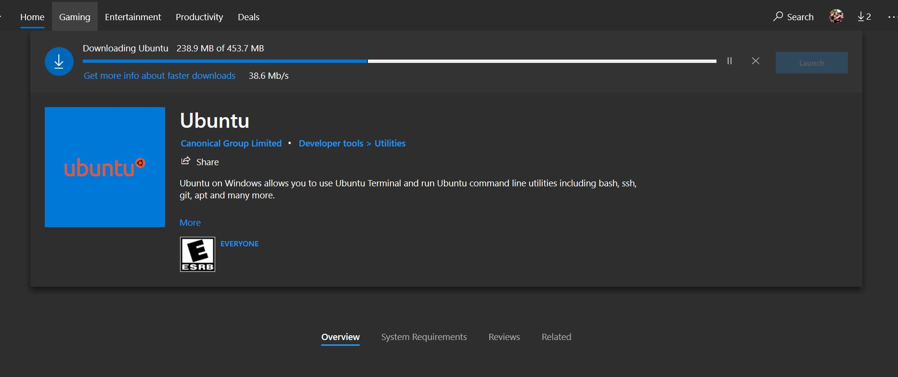

* Reboot the VM
* Once it comes back up and you login to the VM Hit the windows key and search for and select Ubunto

**Ubuntu Installing after launching**

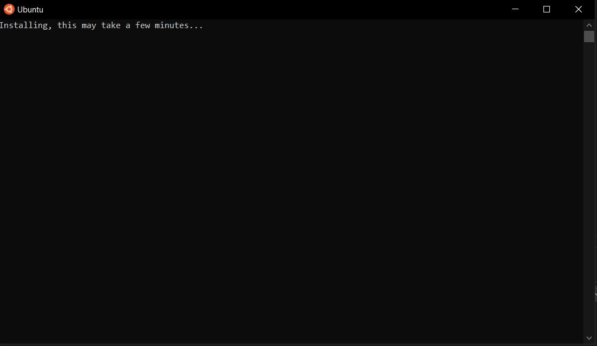

* Enter the username for your WSL2 Ubuntu instance
    * Note: Your user name can't have any caps in it, so BLane must be blane
* Enter a password 
* Reboot your computer

<h2>27. Install Docker Desktop</h2>

**From an elevated powershell window run the following commands**

```Powershell
choco install docker-desktop -y
Restart-Computer
```

<h2>28. Clone the Global Server repo</h2>

Connect to the VPN by executing "Pulse Secure Start Stop" from this VMs host

**From an elevated powershell window run the following commands**
**Note: If your repos path is different than the below, please change the $repoPath before running**

```Powershell
[string]$repoPath = "c:\Projects"
If (Test-Path -Path $repoPath) { Write-Host("Repo Path already there") } else { New-Item -ItemType Directory -Path $repoPath; Write-Host("Creating Repo Path") }
git clone https://git.rockfin.com/marketing-web/sitecore-global-components-server.git
```

Disconnect from the VPN by executing "Pulse Secure Start Stop" from this VMs host

<h2>29. Setup Powershell 5 and 7 as best for a Developer (<em>Optional</em>)</h2>

#### Do this in both Powershell 7 (pwsh) and Powershell 5 (powershell)
#### The exact same commands should be executed in both
#### If you didn't use c:\projects as your repo root change the below references to it 

```Powershell

Set-ExecutionPolicy -ExecutionPolicy RemoteSigned

Write-Warning("Ignore 'Module Repository 'PSGallery' exists.' error if you see it")
Register-PSRepository -Default
Install-Module Posh-Git -Force

[string]$allUsersAllHostsProfileScriptValue = @'

Write-Host "Setting up the all users all hosts Powershell Profile - at $([DateTime]::Now.ToShortTimeString())"

[string]$poshGitModuleName = "Posh-Git"
Write-Host("Loading up $poshGitModuleName")
Get-Command -Module $poshGitModuleName | Out-Null

Write-Host("-----------------------------")
Write-Host

'@

Set-Content -Path $PROFILE.AllUsersAllHosts -Value $allUsersAllHostsProfileScriptValue

[string]$allUsersCurrentHostProfileScriptValue = @'

Write-Host "Setting up the all users current hosts Powershell Profile - at $([DateTime]::Now.ToShortTimeString())"

[string]$startupPath = "C:\Projects"
Write-Host("Setting current location to $startupPath")
Set-Location -Path $startupPath

Write-Host("-----------------------------")
Write-Host

'@

Set-Content -Path $PROFILE.AllUsersCurrentHost -Value $allUsersCurrentHostProfileScriptValue

```

Close and open each console and you should see this now as the profiles are applied 

```Powershell


Setting up the all users all hosts Powershell Profile - at 1:29 PM
Adding the following module path to the PSModulePath: C:\Projects\baxter-w-lane\PSModules\
Loading up Posh-Git
-----------------------------

Setting up the all users current hosts Powershell Profile - at 1:29 PM
Setting current location to C:\Projects
-----------------------------

C:\Projects>

```

<h2>30. Install SVS (Sitecore for Visual Studio)</h2>

<h3>30.1. Request from your Lead a key for SVS</h3>

* Example Lead: Reddy, Yashita
* Example Lead Title: Team Leader, Engineering        
* Example Key: bahc-n9f-m0c-253n __(this one is used already, please don't use it again)__

<h3>30.2. Download Sitecore for Visual Studio 1.0.0.3 and Run through the Installation Wizard</h3> 

**From an elevated powershell window run the following commands**

```Powershell 

[string]$svsFileName = "SVS_1003"
[string]$svsInstallZipUri = "https://www.teamdevelopmentforsitecore.com/-/media/SVS/Files/Releases/$($svsFileName).zip"
[string]$directorySeparatorChar = [System.IO.Path]::DirectorySeparatorChar
[string]$svsInstallZipOutputPath = "$env:USERPROFILE$([System.IO.Path]::DirectorySeparatorChar)Downloads$([System.IO.Path]::DirectorySeparatorChar)$($svsFileName).zip"
[string]$svsInstallUnzippedFolderPath = "$($env:USERPROFILE)$($directorySeparatorChar)Downloads$($directorySeparatorChar)$($svsFileName)$($directorySeparatorChar)"
[string]$installWizardPath = "$($svsInstallUnzippedFolderPath)$($directorySeparatorChar)SVS_1.0.0.3$($directorySeparatorChar)SVS.VSIX.vsix"

If (!(Test-Path -Path $svsInstallZipOutputPath)) {
    Write-Host("Downloading SVS Install Zip")
    Write-Host("   From: $svsInstallZipUri")
    Write-Host("   To: $svsInstallZipOutputPath")
    Invoke-WebRequest -Uri $svsInstallZipUri -OutFile $svsInstallZipOutputPath
} else {
    Write-Host("The SVS Install Zip is already downloaded, so will not download again")
    Write-Host("   Current Path: $svsInstallZipOutputPath")
}

If (!(Test-Path -Path $svsInstallUnzippedFolderPath)) {
    Write-Host("Unzipped SVS Installation Zip")
    Write-Host("   From: $svsInstallZipOutputPath")
    Write-host("   To: $svsInstallUnzippedFolderPath")
    Expand-Archive -LiteralPath $svsInstallZipOutputPath -DestinationPath $svsInstallUnzippedFolderPath
} else {
    Write-Host("The SVS Install Zip has already been Unzipped, just going to use that folder instead")
    Write-Host("   Unzipped Folder Path: $svsInstallUnzippedFolderPath")
}

If (Test-Path -Path $installWizardPath) {
    Start-Process $installWizardPath
} else {
    Write-Error("Couldn't Find the installation wizard at $installWizardPath")
    Write-Warning("   You will have to go onto the Sitecore site and download and install it yourself")
}

```

**Run through the below wizard to finish the installation**

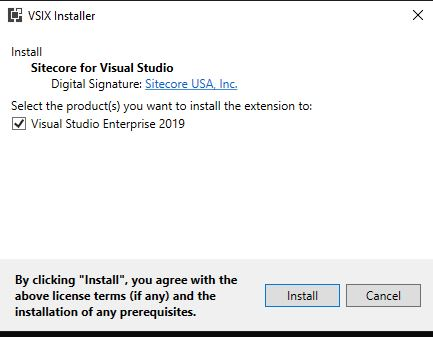

<h3>30.3. Open VS 2019</h3>

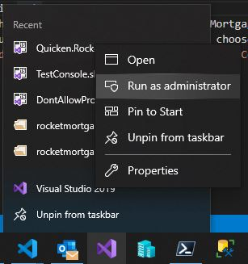

<h3>30.4. Open Quicken.Global.sln from where you cloned the sitecore-global-components-server repo</h3>
* Repo Url: https://git.rockfin.com/marketing-web/sitecore-global-components-server

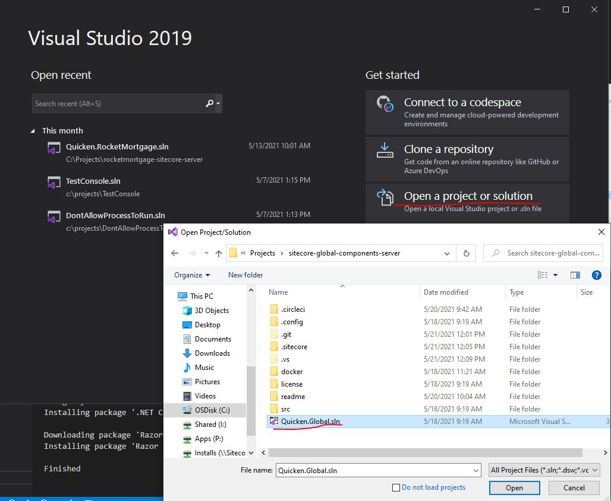

<h3>30.5. If you are prompted to enter a license key upon the solution opening in VS 2019</h3>
* See "Enter Your License Key" below for details

<h3>30.6. Open the Sitecore Module Explorer</h3>
  * Right click on the Quicken.Global solution in the Solutions Explorer
  <br>
  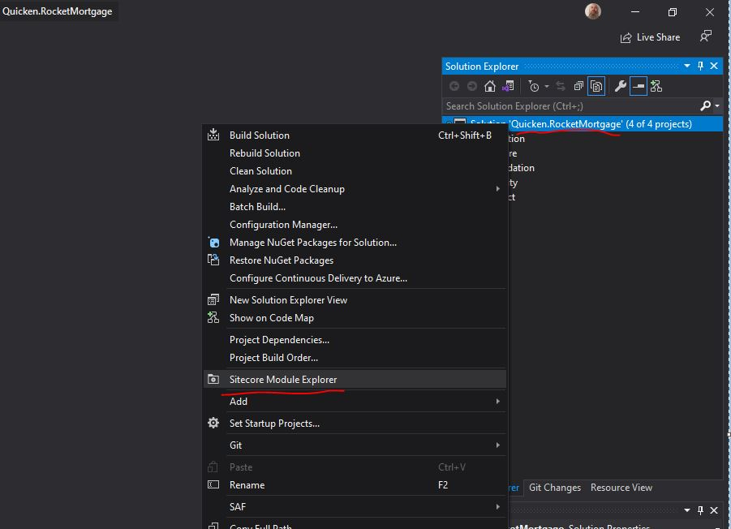
  <br>
  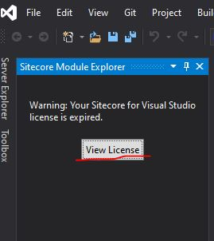

<h3>30.7. Enter Your License Key</h3>

**This Product is License To:** Quicken Loans 

**License Key:** Key obtained from the **Request from your Lead a key for SVS** step above

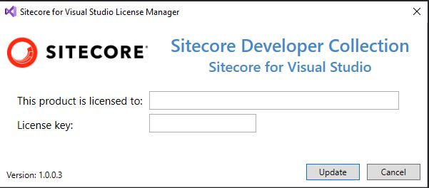

<h3>30.8. Close VS 2019</h3>
<h3>30.11. Open VS 2019 back and open the Quicken.Global.sln again</h3>
<h3>30.12. If prompted to accept the license agreement for SVS, do so, if not close and open VS 2019 in admin mode again and open the Quicken.Global.sln again</h3>

**SVS License Agreement**

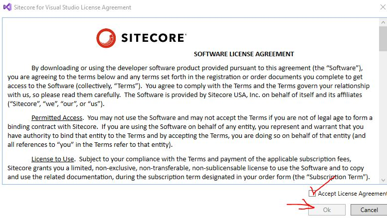

* Here is what the **Sitecore Module Explorer** will look like in Visual Studio 2019 Admin Mode when all is well with SVS


